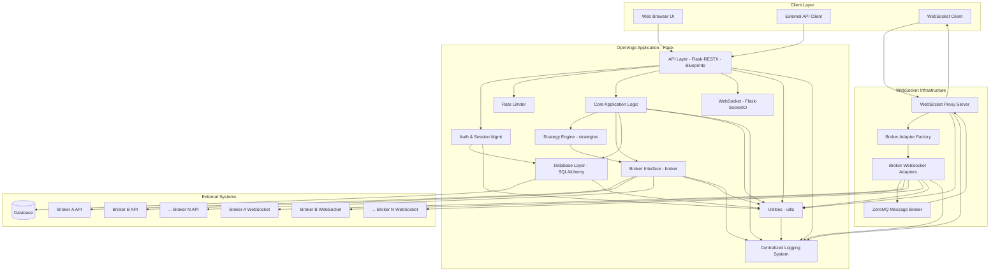

# OpenAlgo System Architecture

## Executive Summary

OpenAlgo is a sophisticated, broker-agnostic algorithmic trading platform built with Python Flask that provides a unified API interface for 25+ Indian stock brokers. The platform enables algorithmic trading strategies through REST APIs, WebSocket connections, and an intuitive web interface.

## Architectural Style

OpenAlgo employs a **Modular Monolithic Architecture** with a **RESTful API** interface, combining the benefits of monolithic simplicity with modular organization through Flask Blueprints and service layers.

### Key Architectural Principles
*   **Broker Abstraction:** Unified interface abstracting broker-specific implementations
*   **Service-Oriented Design:** Clear separation between presentation, business logic, and data layers
*   **Plugin Architecture:** Dynamic broker adapter loading and configuration
*   **Security by Design:** Multi-layered security with encryption, authentication, and authorization
*   **Scalability Ready:** Connection pooling, caching strategies, and horizontal scaling support
*   **Real-time Capabilities:** WebSocket proxy for live market data streaming
*   **Process Isolation:** Strategy execution in isolated processes for stability

## Technology Stack

*   **Programming Language:** Python 3
*   **Web Framework:** Flask
*   **API Framework:** Flask-RESTX
*   **Database ORM:** SQLAlchemy
*   **Real-time Communication:** Flask-SocketIO, WebSocket Proxy Server
*   **Rate Limiting:** Flask-Limiter
*   **Cross-Origin Resource Sharing:** Flask-CORS
*   **Authentication:** Flask-Login, Flask-Bcrypt, PyJWT (likely for API keys/tokens)
*   **Web Server Gateway Interface (WSGI):** Werkzeug (Flask's default), potentially Gunicorn/uWSGI for production.
*   **Database:** (Defined by `DATABASE_URL` environment variable, likely PostgreSQL or MySQL based on common usage with SQLAlchemy)
*   **Environment Management:** python-dotenv
*   **Deployment:** Docker (Dockerfile, docker-compose.yaml), AWS Elastic Beanstalk (`.ebextensions`)
*   **Frontend (UI Templates):** Jinja2, potentially with Tailwind CSS (based on `tailwind.config.js`)
*   **Message Broker:** ZeroMQ for internal communication
*   **WebSocket Infrastructure:** Custom WebSocket proxy with broker-specific adapters
*   **Logging System:** Centralized colored logging with sensitive data filtering
*   **Streaming Data:** Real-time market data distribution via WebSocket connections

## Directory Structure Overview

*   `.ebextensions/`: Configuration files for AWS Elastic Beanstalk deployment.
*   `blueprints/`: Contains Flask Blueprints, organizing application features and web routes (e.g., `auth`, `dashboard`, `orders`).
*   `broker/`: Core logic for interacting with different stock brokers. Contains subdirectories for each supported broker (e.g., `jainampro`).
*   `database/`: SQLAlchemy models, database initialization scripts, and data access logic (e.g., `auth_db.py`, `user_db.py`).
*   `design/`: Location for this design documentation.
*   `docs/`: Likely contains user-facing documentation or generated docs.
*   `restx_api/`: Defines the Flask-RESTX API structure, namespaces, and models.
*   `static/`: Static assets for the web UI (CSS, JavaScript, images).
*   `strategies/`: Implementation of trading strategies.
*   `templates/`: Jinja2 HTML templates for the web UI.
*   `utils/`: Common utility functions and classes used across the application (e.g., `env_check.py`, `latency_monitor.py`, `plugin_loader.py`).
*   `websocket_proxy/`: WebSocket proxy server implementation with broker adapters for real-time market data streaming.
*   `app.py`: Main Flask application entry point, initializes the app, extensions, and blueprints.
*   `pyproject.toml`: Defines Python package dependencies and project metadata.
*   `Dockerfile`, `docker-compose.yaml`: Configuration for building and running the application with Docker.
*   `.env`, `.sample.env`: Environment variable configuration.

## Component Diagram (Mermaid)

